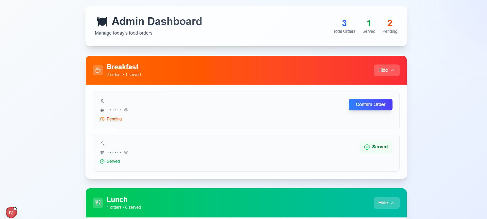
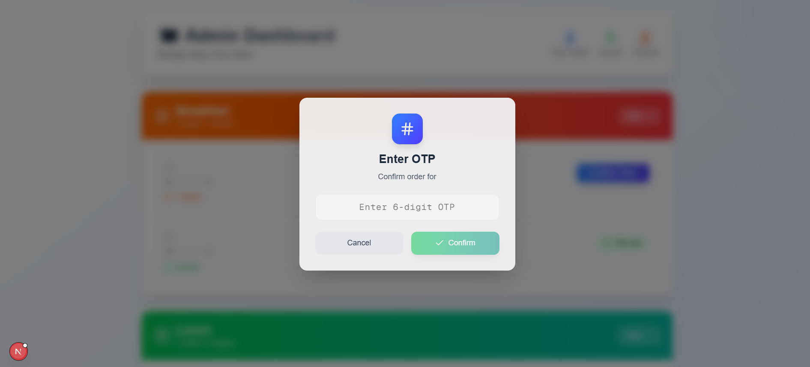

# 🍽️ Canteen Management System

A modern full-stack web application to manage and automate meal booking and delivery in a college canteen. Built using **Next.js**, **Flask**, and **MySQL**, this system simplifies the process for students to book meals and for canteen admins to manage and serve them efficiently.

---

## 🧩 Features

### 👨‍🎓 Student Interface
- 🔐 **Login with JWT authentication**
- 📅 **Book meals** (Breakfast, Lunch, Dinner)
- ❌ **Cancel bookings** anytime before the meal time
- 🧾 **View order history** (`/orders` page)
- 🔢 **OTP-based meal collection** with real-time verification
- ✅ **Live feedback** after booking/cancellation

### 🧑‍🍳 Canteen Admin Interface
- 📊 **Dashboard** with meals separated into sections
- 👁️ **Show/Hide meal sections** dynamically
- ✅ **Confirm meal delivery** using OTP verification
- 📈 **Statistics Page** with:
  - Monthly food consumption (by meal)
  - Weekly consumption
  - Average daily and monthly trends
  - Clean, interactive **bar and line graphs**

---

## 📸 


### 🎓 Student Login


### 🎓 Student Register


### 🎓 Student Dashboard


### 🍳 Admin Dashboard


### 🔐 OTP Confirmation


---

## ⚙️ Tech Stack

### Frontend
- [Next.js 15+](https://nextjs.org/)
- [Tailwind CSS](https://tailwindcss.com/)
- [Chart.js](https://www.chartjs.org/) (via `react-chartjs-2`)
- Native **Fetch API** (no Axios)

### Backend
- [Flask](https://flask.palletsprojects.com/)
- [MySQL](https://www.mysql.com/) with MySQL Connector
- [PyJWT](https://pyjwt.readthedocs.io/en/stable/) for authentication

---

## 🚀 Getting Started

### ✅ Frontend Setup

```bash
cd frontend
npm install
npm run dev
